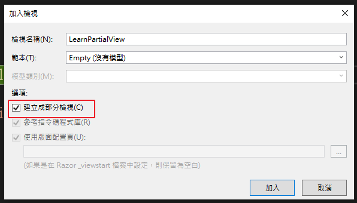
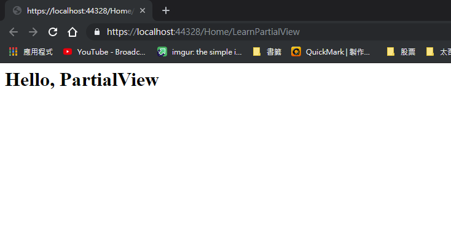
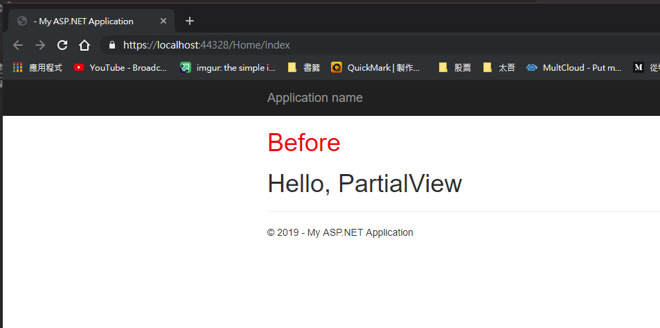

## PartialView

> 只回傳一部份的HTML文件，可獨立存取或者透過 Razor 渲染在其他頁面內。
>
> 透過 RenderAction 渲染可以取得伺服器資料
>
> ``` csharp
> @{Html.RenderAction(ControllerName);}
> ```

- 建立 Controller

	> PartialView 的控制器一樣可以攜帶資料。

	```csharp
	public ActionResult LearnPartialView()
	{
	    ViewBag.text = "Hello, PartialView";
	    return PartialView();
	}
	```

- 建立部分檢視
	

	

- 設定 PartialView 內的文字並啟動

	```html
	<h1>@ViewBag.text</h1>
	```

	

- 設置 Index 並指定渲染位置

	```html
	<!DOCTYPE html>
	<html>
	<head>
	    <meta name="viewport" content="width=device-width" />
	    <title>Index</title>
	</head>
	<body>
	    <h1 style="color: red">Before</h1>
	    <div>
	        @{ Html.RenderAction("LearnPartialView");}
	    </div>
	</body>
	</html>
	```

	

- 額外設置

	```csharp
	// 在控制器前加入這行可以避免 Server 取到 Cache
	[OutputCache(NoStore=true,Duration=0)]
	
	// 在控制器內加入限定 AJAX 才能取得資料
	if (Request.IsAjaxRequest()){ ... }
	```

	

### 應用

- 與 AJAX 配合取得更新後的頁面資料

## Reference

- [[ASP.NET MVC]如何使用PARTIAL VIEW(部分檢視)](https://dotblogs.com.tw/kevinya/2015/11/06/153816)