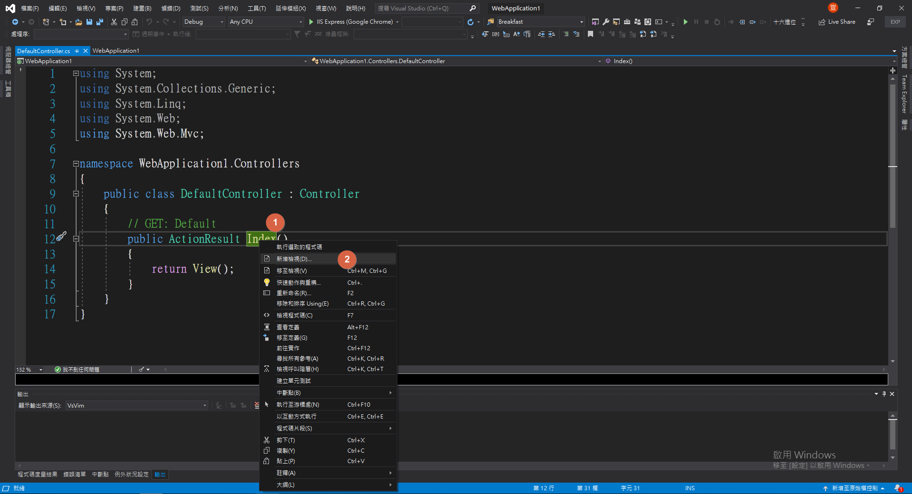
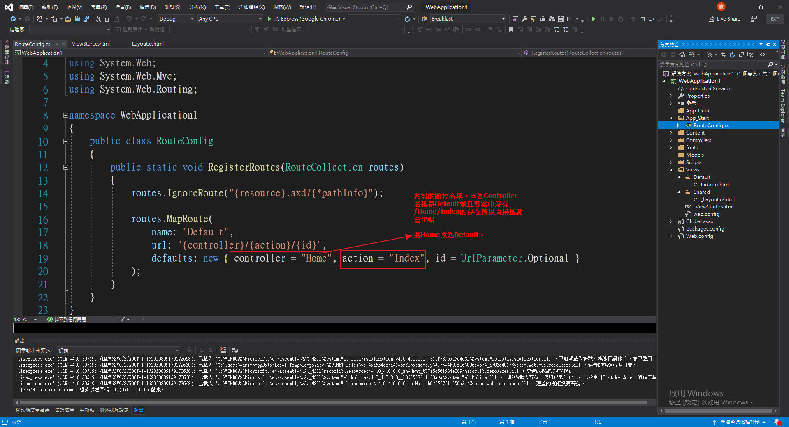

## MVC專案結構

### Hello, MVC.

- 建立控制器

	- Controller資料夾右鍵開啟精靈

		

	- 選擇MVC控制器

		

	- 設定控制器名稱

		> **控制器名稱必須有Controller結尾**

		

	- 控制器內容

		

- 建立檢視

	- 在ActionResult的名稱上右鍵

		

	- VIEW相關設定

		.png)

	- 頁面建立完成

		

	- 初次建立VIEW增加的東西

		

	- 版面配置頁

		

		- ViewStart

			

- RouteConfig

	- 直接啟動專案

		> *~~安定的炸裂了~~*

		

	- 修改預設路徑

		

	- 啟動專案

		

		- 修改瀏覽器網址

			> MVC架構的網頁網址架構為
			>
			> 網域名稱/Controller/View
			>
			> 因為默認路徑修改過了，所以localehost直接啟動時的網頁與localhost/Default/Index的網頁是同一個。
			
			