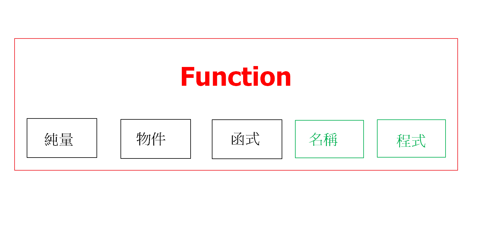

## Function

> JS 的函式屬於一級函式(First-class function)，可以將函式用在任何地方。




- invocation (執行)

	> JS 在單字後面加上()表示呼叫函式，所有的函式都會創造一個執行環境。

	```js
	function hi(){}
	// 執行 hi
	hi();
	
	var hi = function(){};
	hi();
	```

- Immediately Invoked Function Expressions(IIFE)

	> 在表達式之後加上()使函式在創造時立即執行。

	```js
	(function (){
	    // do something
	}());
	
	// 傳參數
	var param = what;
	(function(args){
	    // do something
	}(param));
	```

- Closures (閉包)

	> JS 實作私有成員的寫法。
	>
	> 一般情況下，執行環境結束之後記憶體的空間會被釋放，但 JS 引擎會自動將需要被使用的變數留下成為閉包。

	```js
	function Talk(sayWhat){
	    // sayWhat 無法被外界呼叫
	    return function(name){
	        console.log(sayWhat + " " + name);
	    }
	}
	
	var hello = Talk("Hello");
	
	hello("Kai");
	```

- Callback

	> 執行結束之後再執行被傳入的函式

	```js
	function Talk(callback, sayWhat) {
	    sayWhat += "Yaaaaaa";
	    callback(sayWhat);
	}
	
	Talk(function (param) {
	    console.log(param);
	}, "Hello, JS.");
	
	// output: Hello, JS.Yaaaaaa
	```

- 控制 this 指向的物件

	- call

		```js
		var person = {
		    firstname: "Kai",
		    talk: function (sayWaht) {
		        var fullname = sayWaht + this.firstname;
		        return fullname;
		    }
		}
		
		var who = function (sayWaht) {
		    console.log(this.talk(sayWaht));
		};
		
		// 使用 call 將 this 指向 person 並且執行 who，在物件之後用, 分隔可以傳入參數
		who.call(person, "Hello, ");
		```

	- apply

		> 與 call 相同，差別在只接受陣列作為參數。

		```js
		who.apply(person, ["Hello, "]);
		```

	- bind

		> 直接產生物件的複製給 function 參考

		```js
		var person = {
		    firstname: "Kai",
		    talk: function (sayWaht) {
		        var fullname = sayWaht + this.firstname;
		        return fullname;
		    }
		}
		
		var who = function (sayWaht) {
		    console.log(this.talk(sayWaht));
		}.bind(person);
		
		who("Hello, ");
		```

