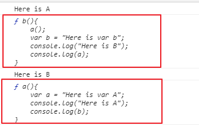

## 作用域

>  JS執行時會分成兩個階段，在創造階段會分配記憶體並且將所有變數置頂(Hoisting)並寫入 undefined ，而每個 function 內會被視為單獨的執行環境因此具有自己的變數環境。

### 變數宣告

- 未宣告會直接成為全域變數

	```js
	firstName = "Kai";
	function fullName() {
	    lastName = "Hsieh";
	    console.log(firstName + " " + lastName);
	    // output: Kai Hsieh
	}
	console.log(firstName)
	// ourput: Kai
	
	// console.log(lastName);
	// output: error = lastName is not defined
	
	fullName();
	
	console.log(lastName);
	// output: Hsieh
	```

- var

  > 函式作用域

  - 函式
  	```js
  	// 函式作用域測試
  	var firstName = "Kai";
  	function fullName() {
  	    var lastName = "Hsieh";
  	    console.log(firstName + " " + lastName);
  	    // output: Kai Hsieh
  	}
  	console.log(firstName);
  	// ourput: Kai
  	
  	// console.log(lastName);
  	// output: error = lastName is not defined
  	
  	fullName();
  	
  	console.log(lastName);
  	// output: error = lastName is not defined
  	```
  	
  - 區塊

  	```js
  	for (var i = 0; i < 1; i++) {
  	    console.log("inside=" + i);
  	    // output: inside=0
  	}
  	
  	console.log("outside=" + i);
  	// output:outside=1
  	```

- let

  > 區塊作用域
  >
  > 一樣在創造階段就寫入記憶體，但是除非執行到該程式碼區塊否則JS引擎不讓你使用let 宣告的變數。

  - 函式
  	```js
  	let firstName = "Kai";
  	function fullName() {
  	    let lastName = "Hsieh";
  	    console.log(firstName + " " + lastName);
  	    // output: Kai Hsieh
  	}
  	console.log(firstName)
  	// ourput: Kai
  	
  	// console.log(lastName);
  	// output: error = lastName is not defined
  	
  	fullName();
  	
  	// console.log(lastName);
  	// output: error = lastName is not defined
  	```
  	
  - 區塊

  	```js
  	for (let i = 0; i < 1; i++) {
  	    console.log("inside=" + i);
  	    // output: inside=0
  	}
  	
  	console.log("outside=" + i);
  	// output:error= i is not defined
  	```

- const

	> 區塊作用域

	- 函式
		```js
		const firstName = "Kai";
		function fullName() {
		    const lastName = "Hsieh";
		    console.log(firstName + " " + lastName);
		    // output: Kai Hsieh
		}
		console.log(firstName)
		// ourput: Kai
		
		// console.log(lastName);
		// output: error = lastName is not defined
		
		fullName();
		
		// console.log(lastName);
		// output: error = lastName is not defined
		```
		
	- 區塊
	
		```js
		for (let i = 0; i < 1; i++) {
		    const c = "inside"
		    console.log(c);
		    // output: inside
		}
		
		console.log(c);
		// output:error= c is not defined
		```

## Function

### **不要讓變數與函式的名稱重複**

```js
function a(){
    var a = "Here is var A";
    console.log("Here is A");
    console.log(b);
}

function b(){
    a();
    var b = "Here is var b";
    console.log("Here is B");
    console.log(a);
}

b();
```



```js
function b(){
    var myVar;
    console.log(myVar);
}

function a(){
    var myVar = 2;
    console.log(myVar);
}

var myVar = 1;
console.log(myVar);
a();
console.log(myVar);

// output:
// 1
// 2
// undefined
// 1
```

```js
function b()｛
	console.log(myVar);
}

function a(){
    var myVar = 2;
    b();
}

var myVar = 1;
a();
// output: 1
```

```js
function a(){
    function b(){
        console.log(myVar);
    }
    var myVar = 2;
    b();
}

var myVar = 1;
a();
b();
// output:
// 2
// uncaught Referenceerror: b is not defined
// b 無法在全域下被呼叫
```


## Reference

- [JavaScript 宣告: var、let、const](https://www.iware.com.tw/blog-JavaScript 宣告: var、let、const.html)
- [[筆記] JavaScript 變數宣告與作用域](https://kuro.tw/posts/2015/07/08/note-javascript-variables-declared-with-the-scope-scope/)

