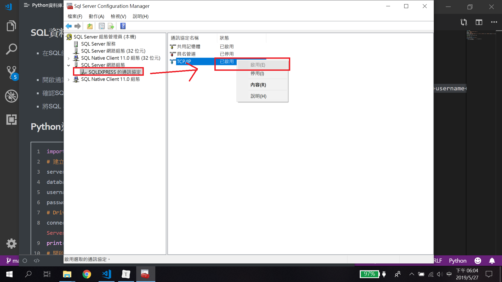
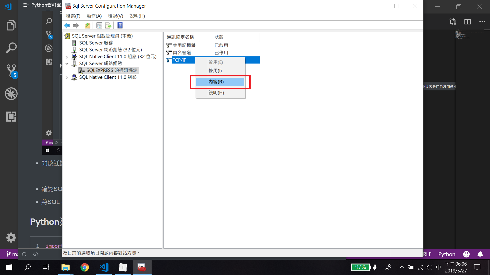
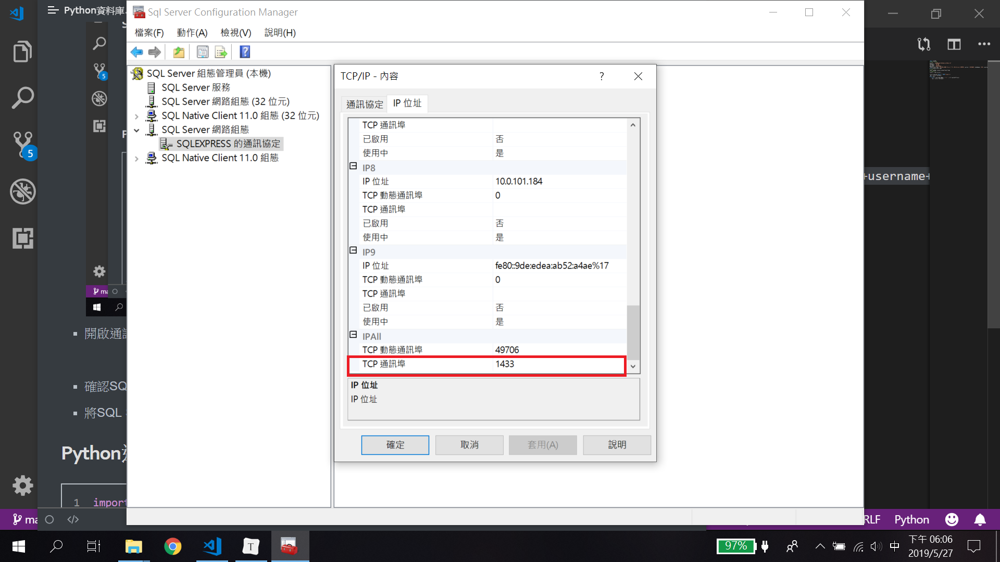
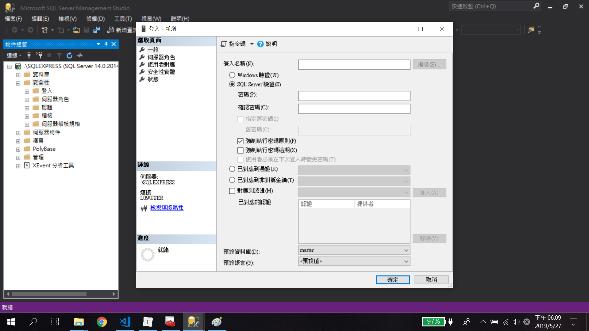
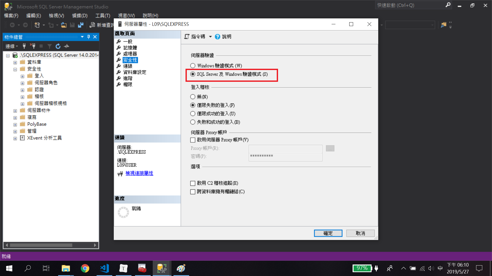
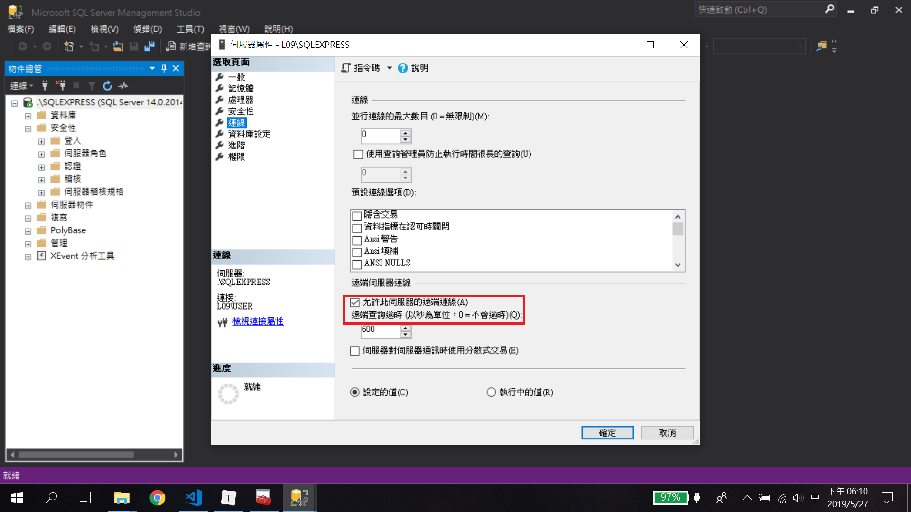

## SQL資料庫

- 在SQL組態工具TCP/IP

  

- 開啟通訊埠

  
  
  

- 確認SQL使用者帳號密碼

  

- 將SQL Server屬性開啟為混和認證

  

- 確認Server可以接受連線

  

## Python連線SQL

```python
import pyodbc
# 建立連線字串
# SERVER = 'tcp: 0.0.0.0'
server = 'smit09exam.database.windows.net' 
database = 'SMIT09' 
username = 'smit09' 
password = 'Aa20190625' 
# Driver可以透過系統工具查詢。
connectionstring = 'DRIVER={ODBC Driver 17 for SQL Server};SERVER='+server+';DATABASE='+database+';UID='+username+';PWD='+ password
print(connectionstring)
# 開啟連線
conn = pyodbc.connect(connectionstring) 
# 建立Cursor
cursor = conn.cursor()

cursor.execute("SELECT * FROM Products")
# 取得資料行
row = cursor.fetchone() 
while row: 
    print (row.ProductName + "\t| " + str(row.UnitPrice)) 
    row = cursor.fetchone()
```

