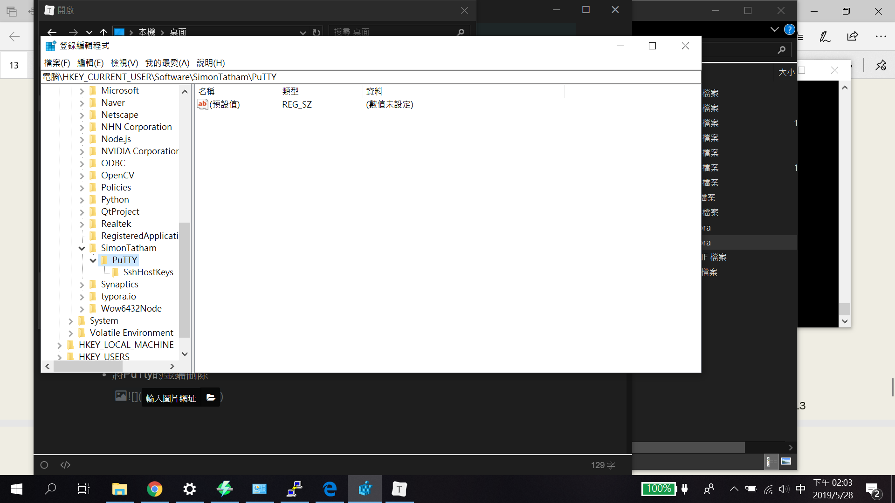

## UNIX

- 使用映像檔燒錄作業系統

  - Etcher

- putty

- VcXsrv Windows X Server

  - 把openCV開啟的視窗傳到windows

- Terminus

- angry ip

- ssh空檔案

  - 有大小寫區別
  - 開啟樹梅派的連線功能

- Ubuntu 

  > PC主流的Unix系統

- etc放置所有系統參數 一定要用sudo開

### UNIX Command

- sudo = super user do
  - sudo raspi-config
- 操作用上下跟TAB

### 樹梅派預設帳密

- pi
- raspberry
- cat /etc/wpa_supplicant/wpa_supplicant.conf

## 連線問題

> 當不同樹梅派IP相同時會遇到金鑰錯誤，Windows上面Putty並不會顯示錯誤訊息。

- 將PuTty的金鑰刪除

  

### 基本設定

- sudo raspi-config
  - boot option
  - localisation
  - ​	

### vi

- esc進入指令模式
  - 預設為指令模式
  - 沒事都放在指令模式
- a / i / o 編輯模式
  - a = append
  - i = 現在位置
  - o=開新的一行
- 移動游標
  - h j k l
- :開啟命令列
  - 存檔 :w
  - :wq 存檔離開
  - :q! 強制離開
  - G 移動到最尾端
  - :n =移動道第N行
  - yy 複製 p 貼上
  - dd 剪下 p 貼上
  - x 刪除一個字
  - dw 刪除一個單字
  - u 復原
  - r 取代一個字
  - :. 重複上一個動作
- / 關鍵字 = 搜尋字串
- 搜尋取代 :%s/要替代的字/g

## SAMBDA

> 透過網路芳鄰操作樹梅派內的資料

